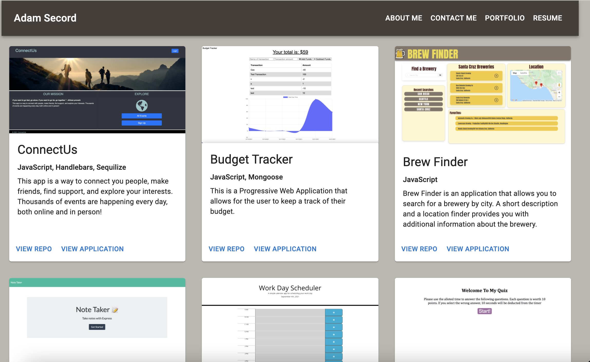

# React Portfolio

### This is a portfolio of my current works created using React and Material UI. Please see below screenshot

## Deployed application:
https://asecord92.github.io/react-portfolio

## Table of Contents
* [Technologies used](#technologies-used)
* [License](#license)
* [Contributors](#contributors)
* [Questions](#questions)

## Technologies Used
* React
* Material UI
* JS

## License
This project is licensed under the MIT license.

## Contributor
* Adam Secord [@asecord92](https://github.com/asecord92)

## Questions?
If you have any questions about the project, contact any of the contributors above. 